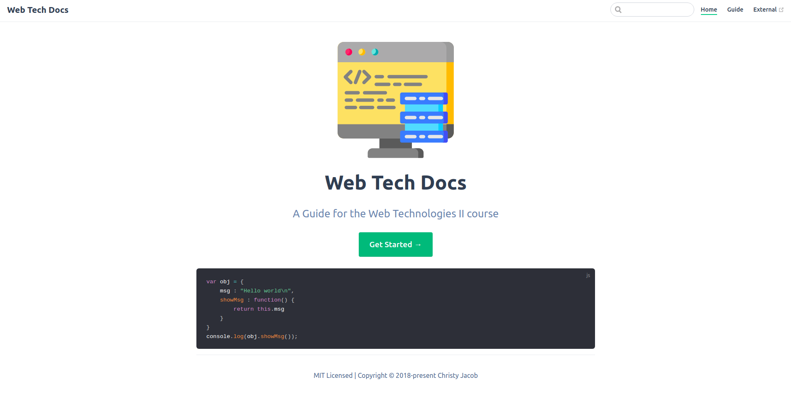

<h1 align="center">Web Tech Docs 📔</h1>
<p align = center>
    
</p>

<p align="center">


  

  <!--  -->

  <a href="https://github.com/christyjacob4/web-tech-docs/blob/master/LICENSE">
    
  </a>

  <a href="https://twitter.com/christyjacob4">
    
  </a>

  

</p>
<h3 align="center">A website to serve as a reference material for anyone undertaking the web technologies course. </h3>


## 🚀 Usage

* ### Clone the repository
```sh
git clone https://github.com/christyjacob4/web-tech-docs/
cd web-tech-docs
```

* ### Install dependencies
```sh
yarn add -D vuepress
```

* ### Start developement Server
```sh
yarn docs:dev
```

## ✨ Screenshots

<p align="center">
    
</p>

<!-- ## 📖 Features

- [x] Basic to Advanced JS Concepts
- [x] 
- [x] Mark tasks as completed
- [x] Dark Mode
- [x] Firebase Support  -->


## 🍻 Contributing

Contributions, issues and feature requests are welcome.<br />
Feel free to check [issues page](https://github.com/christyjacob4/web-tech-docs/issues) if you want to contribute.


## 👤 Author

**Christy Jacob**

- Twitter: [@christyjacob4](https://twitter.com/christyjacob4)
- Github: [@christyjacob4](https://github.com/christyjacob4)

## 🤝 Acknowledgements
- Icons by [Flaticon](https://www.flaticon.com/)


## 🙌 Show your support

Please ⭐️ this repository if this project helped you!

## 📝 License

Copyright © 2019 [Christy Jacob](https://github.com/christyjacob4).<br />
This project is [MIT](https://github.com/christyjacob4/web-tech-docs/blob/master/LICENSE) licensed.

---
